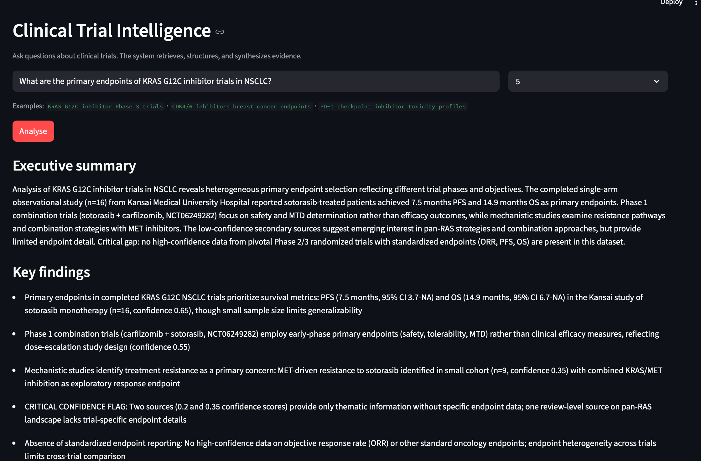
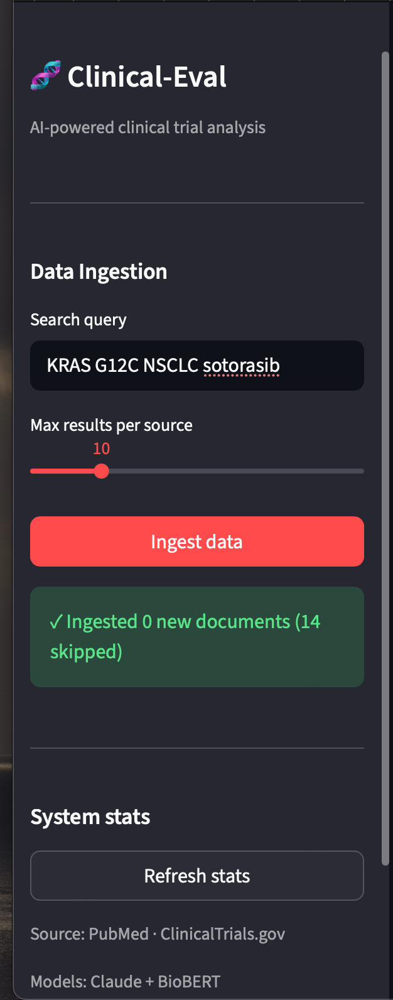
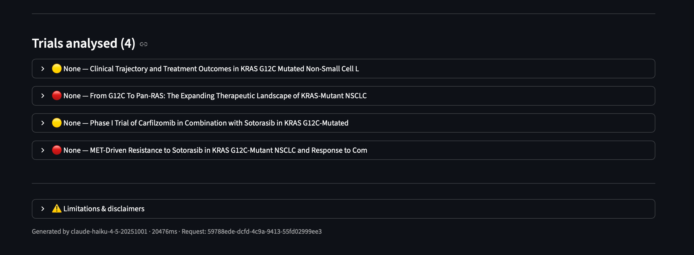
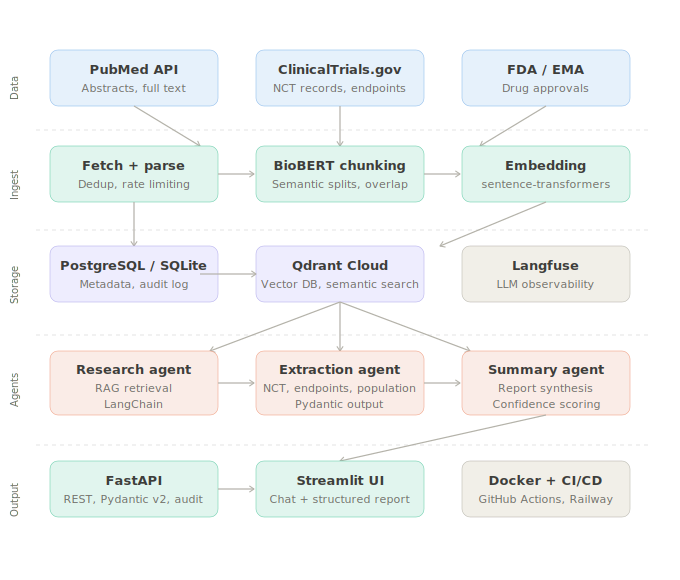

# clinical-eval

AI-powered clinical trial intelligence platform. Ingests evidence from PubMed and ClinicalTrials.gov, structures it via a multi-agent pipeline, and generates analyst-grade reports with confidence scores and source citations.

Built as a production-grade reference implementation for AI engineering in regulated industries (pharma, life sciences).

---

### Streamlite



*Multi-agent pipeline analysing KRAS G12C inhibitor trials — executive summary with confidence-flagged findings*



*Ingesting documents from PubMed and ClinicalTrials.gov — idempotent, deduplication built in*



*Structured extraction per trial — phase, status, endpoints, confidence score, source links*

---

### Architecture

[](docs/architecture.svg)

```
PubMed API ──────────────┐
                         ├──► Ingestion pipeline ──► Qdrant (vectors)
ClinicalTrials.gov API ──┘    BioBERT chunking      PostgreSQL (metadata + audit log)
                                                            │
                                          ┌─────────────────┤
                                          │                 │
                                   Research Agent    Extraction Agent
                                   RAG retrieval     Pydantic output
                                          │                 │
                                          └────── Summary Agent ──► FastAPI ──► Streamlit UI
                                                                         │
                                                                   Langfuse (LLM observability)
```

Stack: Python 3.11 · FastAPI · Pydantic v2 · Anthropic Claude · HuggingFace BioBERT · Qdrant · SQLite/PostgreSQL · Docker · GitHub Actions

---

### Features

**Data pipeline**
- Fetches from PubMed E-utilities API and ClinicalTrials.gov API v2
- Semantic chunking with 64-token overlap
- BioBERT embeddings for biomedical-domain retrieval precision
- Idempotent ingestion — re-running the same query is a safe no-op

**Multi-agent system**
- Research Agent — RAG retrieval from Qdrant vector store
- Extraction Agent — structures raw text into typed Pydantic models (NCT number, phase, status, endpoints, population criteria, confidence score)
- Summary Agent — synthesizes executive report with evidence gaps flagged explicitly

**Production patterns**
- Every LLM call traced in Langfuse (latency, tokens, cost)
- Audit log — every ingestion and query recorded in the database
- Typed config via Pydantic Settings — all secrets from environment
- Graceful error handling — pipeline never crashes on malformed LLM output
- Request correlation IDs on every API response

---

### Quickstart

**Prerequisites:** Python 3.11+, Anthropic API key, Qdrant Cloud account (free tier)

**1. Clone and configure**

```bash
git clone https://github.com/your-username/clinical-eval.git
cd clinical-eval
cp .env.example .env
# Edit .env — add ANTHROPIC_API_KEY and QDRANT credentials
```

***2. Install dependencies***

```bash
python3 -m venv .venv
source .venv/bin/activate
pip install -r requirements.txt
```

***3. Run the API***

```bash
uvicorn src.api.app:app --host 0.0.0.0 --port 8000
```

**4. Run the UI*** (new terminal)

```bash
.venv/bin/streamlit run ui/app.py
```

Open [http://localhost:8501](http://localhost:8501)

---

### Usage

**Step 1 — Ingest data**

In the sidebar, enter a search query and click Ingest data:
```
KRAS G12C NSCLC sotorasib
```
The system fetches from PubMed and ClinicalTrials.gov, chunks, embeds, and stores — typically 10–20 documents per query.

**Step 2 — Query**

Ask a natural language question in the main panel:
```
What are the primary endpoints of KRAS G12C inhibitor trials in NSCLC?
```

The multi-agent pipeline retrieves relevant chunks, extracts structured data per trial, and synthesises an executive report with confidence scores and source citations.

**Via API directly**

```bash
# Ingest
curl -X POST "http://localhost:8000/ingest?query=KRAS+G12C+NSCLC&max_per_source=10"

# Query
curl -X POST http://localhost:8000/query \
  -H "Content-Type: application/json" \
  -d '{"query": "KRAS G12C primary endpoints", "max_results": 5}'
```

---

### Project structure

```
clinical-eval/
├── src/
│   ├── core/
│   │   ├── config.py          # Pydantic Settings — all config from environment
│   │   └── models.py          # Domain models: RawDocument, ExtractedTrialData, TrialReport
│   ├── ingestion/
│   │   ├── pubmed_client.py           # Async PubMed E-utilities client
│   │   ├── clinicaltrials_client.py   # Async ClinicalTrials.gov API v2 client
│   │   └── pipeline.py                # Orchestrates fetch → chunk → embed → store
│   ├── agents/
│   │   └── orchestrator.py    # ResearchAgent · ExtractionAgent · SummaryAgent
│   ├── api/
│   │   └── app.py             # FastAPI — audit middleware, lifespan, typed endpoints
│   └── storage/
│       ├── qdrant_store.py    # Vector store — semantic search
│       └── postgres_store.py  # Metadata + audit log (SQLite locally, PostgreSQL in prod)
├── ui/
│   └── app.py                 # Streamlit interface
├── tests/
│   └── unit/
│       └── test_extraction_agent.py
├── infra/
│   ├── Dockerfile
│   └── Dockerfile.ui
├── docs/                      # Screenshots
├── .github/workflows/
│   └── ci.yml                 # Lint → type check → test → build → push
├── docker-compose.yml
├── requirements.txt
└── .env.example
```

---

### Running tests

```bash
pip install -r requirements-dev.txt
pytest tests/ -v --cov=src
```

---

### Observability

LLM traces are sent to [Langfuse](https://langfuse.com) (free tier). Add `LANGFUSE_PUBLIC_KEY` and `LANGFUSE_SECRET_KEY` to `.env` to enable.

Each trace captures: agent name · model · input/output tokens · latency · confidence score per extraction.

---

### Production considerations

This is a portfolio reference implementation. A production deployment in a regulated environment would additionally require:

- Authentication — SSO, role-based access control
- Data encryption — at rest and in transit
- Compliance — HIPAA / GDPR data residency, immutable audit log
- LLM output validation — clinical expert review before any output is acted upon
- Model versioning — track which model version generated each report
- Disaster recovery — database backups, vector store snapshots

---

### License

This project is open-source and available under the [MIT License](LICENSE).

Built as a portfolio project demonstrating end-to-end AI engineering in regulated industries.
Inspired by real-world challenges at pharma and life sciences companies including clinical data
management, evidence synthesis, and AI-assisted drug development workflows.